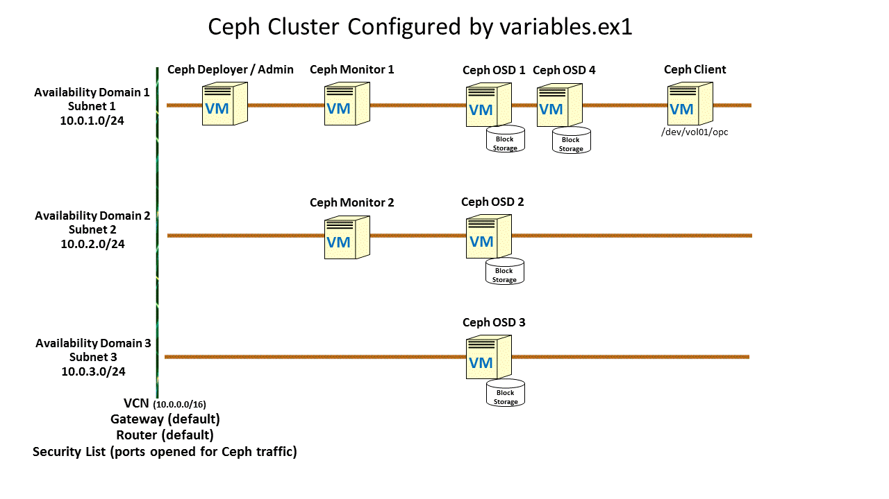

[terraform]: https://terraform.io
[oracle linux]: https://www.oracle.com/linux/index.html
[ceph]: https://ceph.com/
[ceph rel note]: https://docs.oracle.com/cd/E52668_01/E66514/E66514.pdf
[OCI]: https://cloud.oracle.com/cloud-infrastructure
[oci provider]: https://github.com/oracle/terraform-provider-oci/releases
[SSH key pair]: https://docs.us-phoenix-1.oraclecloud.com/Content/GSG/Tasks/creatingkeys.htm
[API signing]: https://docs.us-phoenix-1.oraclecloud.com/Content/API/Concepts/apisigningkey.htm
[yum terraform]: http://public-yum.oracle.com/repo/OracleLinux/OL7/developer/x86_64/getPackage/terraform-0.11.3-1.el7.x86_64.rpm
[yum oci provider]: http://public-yum.oracle.com/repo/OracleLinux/OL7/developer/x86_64/getPackage/terraform-provider-oci-2.0.7-1.el7.x86_64.rpm
[ocids and keys]: https://docs.us-phoenix-1.oraclecloud.com/Content/API/Concepts/apisigningkey.htm

# Terraform Installer for Ceph in Oracle Cloud Infrastructure
# Version: 1.1

## About

[Ceph][ceph] is an open source distributed storage system designed for performance, reliability and scalability.
It provides interfaces for object, block, and file-level storage.
Ceph is now widely used and fully supported on [Oracle Linux][oracle linux] as described in the [Release Notes for Ceph Storage for Oracle Linux Release 2.0][ceph rel note].

[Terraform][terraform] is an Open Source Software (OSS) for building, changing, and versioning Cloud infrastructure safely and efficiently.
[Terraform Provider for OCI][oci provider] allows one to create the necessary Infrastructure resources and configure them in OCI.

The Terraform Installer for Ceph provides Terraform scripts for installing Ceph Clusters in [Oracle Cloud Infrastructure][OCI] (OCI).
It consists of a set of Terraform scripts and modules, bash scripts, and example configurations that can
be used to provision and configure the resources needed to run a Ceph Storage Cluster on OCI.

Using the scripts in this repository, you can streamline and/or replicate your Ceph deployment in Oracle Cloud Infrastructure (OCI).

## Ceph Cluster Configuration Overview

A typical Ceph Cluster includes multiple virtual or bare metal machines, referred to as nodes, serving one (or more) of the following:
- Deployer - for installing Ceph on all other nodes
- Monitors - for maintaining the maps of the cluster state and  authentication
- Managers - for keeping track of the cluster state and exposing the cluster information
- Object Storage Daemons (OSDs) - for storing and handling data
- Metadata Server (MDS) - for storing metadata on behalf of the Ceph Filesystem

Deploying Ceph includes creating infrastructure resources (e.g., compute, network, storage), setting them up for Ceph installation, installing various packages on all machines,
and finally configuring and deploying the cluster. This requires a fair bit of knowledge about OCI and Ceph. Carrying out the entire process manually is tedious and error prone.

However, by using the sctipts in this repository, you can create the necessary infrastructure resources and deploy a Ceph cluster using those resources.
The behavior of the scripts are controlled by various configuration files. By changing the variables defined in these files, you can control what resources are created in OCI
(e.g., the number and type of VMs to create for various Ceph nodes), how the Ceph Cluster is configured (e.g., the level of replication), etc.


## Creating a Ceph Cluster

This README guides you through the following steps to accomplish the goal of creating a cluster shown in the pcture below:

- Install Terraform
- Download the scripts
- Setup for access to OCI
- Customize the Ceph Cluster
- Execute the scripts
- Login to a Ceph Admin node and check the status of the Cluster



### Prerequisites
Designate a machine to run Terraform. This machine needs to have the credentials (e.g., the .pem key files under ~/.oci) to access the your tenant in OCI.

This machine should also have the rsa key pair generated for the Linux user on this machine.
This key will be supplied during the creation of the compute nodes to allow the Linux user to perform password-less ssh logins the newly created VMs.

If not, generate the key pair using:
```
$ ssh-keygen -t rsa
```
### Install Terraform
Add and/or enable the following yum repository:
```
[ol7_developer]
name=Oracle Linux $releasever Development Packages ($basearch)
baseurl=https://yum.oracle.com/repo/OracleLinux/OL7/developer/$basearch/
gpgkey=file:///etc/pki/rpm-gpg/RPM-GPG-KEY-oracle
gpgcheck=1
enabled=1
```
Then execute:
```
$ yum install terraform
$ yum install terraform-provider_oci
```
### Download Scripts
Download the Terraform Ceph scripts from this repository.
```
$ git clone https://github.com/oracle/terraform-ceph-installer.git
$ cd terraform-ceph-installer
```
### Setup for access to your OCI tenant
Copy and edit the sample environment file to fill in the information particular to your tenancy which includes the tenant, region, user id, and the credentials to access OCI.
This is the same information you would require to use the OCI-CLI. Please refer to [Required Keys and OCIDs][ocids and keys] to find out the OCIDs and generate the keys needed.

Source it to export the variables in the file.
```
$ cp env-vars.sample env-vars
$ vi env-vars
$ . env-vars
```

### Customize for your OCI tenant
Create a copy (with a .tf extension) of one of the given examples and modify to fit your need and your environment.
The example in variables.ex1 assumes that have existing VCN and subnets for your tenant in OCI and
you deploy the cluster using those subnets.
```
$ cp variables.ex1 variables.tf
```
Edit (if necessary) the following variables:
instance_shapes - The shapes for the compute resources. You can use different shapes for the deployer, monitor, osd, and client but can only assign one shape for all monitors or OSDs. Change any shapes if not available in your environment.
instance_os - The full name of the operating system as displayed when you list them. You will probably need to update it as the OS version is updated frequently in OCI. Follow the same format included as example.
existing_vcn_id - The ocid for the existing VCN. You can find it by login into you tenant using a browser.
existing_subnet_ids - The list of ocids for the existing subnets. You can find them by login into you tenant using a browser.

Create a link for the network module
```
ln -s network.partial modules/network
```

### Execute Scripts
```
# Initialize your Terraform configuration including the modules
$ terraform init
# See what Terraform will do before actually doing it
$ terraform plan
# Provision resources and configure the Ceph cluster on OCI
$ terraform apply
### Check Cluster Status
```

Upon the successful completion, the scripts will print out the names and IP addresses for all the compute nodes which can then be used to access the nodes.
The tail end of the output will look like the following:

```
Outputs:
ceph_client_hostname = [
    test-ceph-client
]
ceph_client_ip = [
    100.100.45.31
]
ceph_deployer_hostname = test-ceph-deployer
ceph_deployer_ip = 100.100.45.30
ceph_monitor_hostname_list = [
    test-ceph-monitor-0,
    test-ceph-monitor-1
]
ceph_monitor_ip_list = [
    100.100.45.33,
    100.100.46.30
]
ceph_osd_hostname_list = [
    test-ceph-osd-0,
    test-ceph-osd-1,
    test-ceph-osd-2
]
ceph_osd_ip_list = [
    100.100.45.32,
    100.100.46.31,
    100.100.48.30
]
```

If you need to list the IP addresses again in the future, enter:
```
$ terraform show
```


### Check the status of the Cluster

```bash
$ ssh -l opc <client-ip-address>
$ ceph status
$ df -h
```

## Known issues and limitations
* Terraform doesn't check for any inconsistencies among various input variables. For example, it will fail if the specified subnet id for a compute node doesn't belong to the specified availability domain for the same node. It is your responsibility to make sure the inputs are consistent with one another.
* Use all lowercase for names of resources. Names with uppercase letters on network resources may cause problems.

